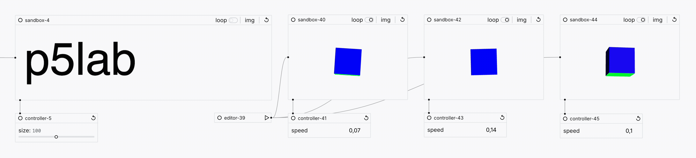
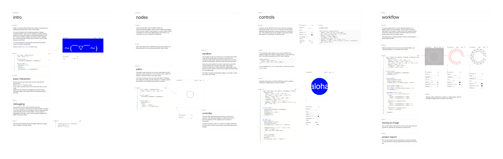

# [p5lab](https://nicolaspasqualis.github.io/p5lab/)
p5lab is a canvas-style interface for running, comparing and experimenting with [p5.js](https://p5js.org/) code in the browser. 

It aims to make algorithmic design workflows easier, with tools for executing multiple stateful instances of the same sketch, modifying parameters using GUI controls (sliders, toggles, text inputs, button triggers, etc), exporting renders, reducing the redraw loop for static designs, and others.

### [p5lab web ↗](https://nicolaspasqualis.github.io/p5lab/)

Check out the [intro example ↗](https://nicolaspasqualis.github.io/p5lab/#/intro) or open a [blank flow ↗](https://nicolaspasqualis.github.io/p5lab/#/new).


> ⚠ The API _will_ have breaking changes. Usage in "serious" projects is discouraged until the tool is proven to be stable and data loss is no longer a risk. Please open an issue if _spooky_ behaviour is encountered.


## Basics

`editor` node:
* Source code editor for p5.js sketches (JavaScript).
* Can be connected to any number of `sandbox` nodes. (top-right output)
* Has access to the `p5lab` object as a library provided by default, which allows defining `controller` input nodes for a sketch.

`sandbox` node: 
* Runs the code of a connected input `editor` node (top-left input).
* Can be connected to controller nodes (if defined in the editor source code) in order to receive live parameter values (bottom-left input).
* Code can be re-executed.
* Can control the loop state of the default p5 re-render behaviour. This is useful for saving resources on static sketches. Controller messages automatically trigger a re-render to keep output up to date. 
* Can save the current canvas state as an image.

`controller` node: 
* Provides interactive controls for a sandbox.
* The controls displayed depend on the schema definition of the sandbox port to which it was connected.
* Can be connected to multiple sandboxes.
* Controls values can be reset to their initial state.

https://github.com/user-attachments/assets/50932e4f-abaa-4048-b717-a70268c6abb1

`info` node:
* An editable text component that can render markdown.
* Useful for adding annotations and links to the canvas.

`log viewer` tool:
* Displays the global logs of all running sandboxes, which is useful for debugging, catching errors, etc.
* It intercepts calls to the console object and error events in the sandbox in order to display the messages.

`metadata` tool:
* Shows useful info of a node on the canvas, like position, dimensions, id, internal data / state. Useful for debugging.

`p5lab` library: 
* Provided as a default global object to the sandbox.
* Contains a method to define controller parameters ```p5lab.controls({})```

## Planned
- API documentation.
- Global undo-redo.
- Keyboard shortcuts.
- Copy / paste of nodes.
- Canvas to video recording.
- Code autocomplete for p5.js and p5lab.
- Multi-select node operations.
- External files / assets.
- Project management.

## Design 
p5lab doesn't provide a full node-based computational flow. At the moment, sandboxes are meant to run p5.js sketches and have no API to talk with other sandbox nodes.

This allows for simple copy-pastable code generation with LLMs, which are quite good at p5 code.
